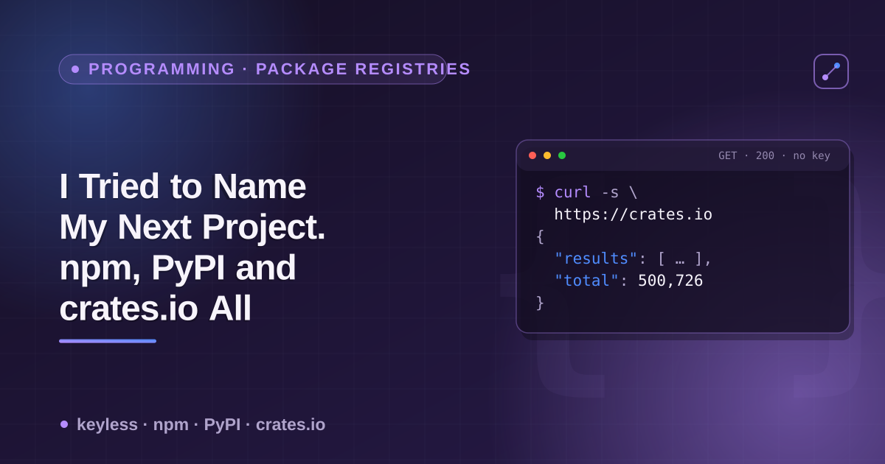

# npm, PyPI & crates.io JSON APIs — a cheatsheet



All three major package registries expose **free, keyless JSON** for package lookup and (mostly) search. No sign-up, no API key. This is the endpoint reference — including the one most people miss: crates.io's own REST API is easy to find, but its **sparse index** (the endpoint `cargo` itself uses) is the fastest, most direct way to check whether an exact name exists.

## Lookup endpoints

| Registry | Endpoint | Auth | Notes |
|---|---|---|---|
| npm | `GET https://registry.npmjs.org/{name}` | none | Full package document — every version, `dist-tags`, `time` (created/modified per version). |
| PyPI | `GET https://pypi.org/pypi/{name}/json` | none | Latest release info + `releases` (every version) + `urls` (files for the latest). |
| crates.io | `GET https://crates.io/api/v1/crates/{name}` | none | Crate metadata + `versions[]`. Standard REST API. |
| crates.io (sparse index) | `GET https://index.crates.io/{path}` | none | See below — the canonical existence check, one JSON-lines response, no extra fields to parse out. |

**crates.io sparse-index path rule** (this is what `cargo` itself queries, and it's the quickest way to answer "does this name exist" without pulling the full REST payload):

| Name length | Path |
|---|---|
| 1 char | `/1/{name}` |
| 2 chars | `/2/{name}` |
| 3 chars | `/3/{first-char}/{name}` |
| 4+ chars | `/{first-2-chars}/{next-2-chars}/{name}` |

```bash
# "grid" (4 chars) -> /gr/id/grid
curl -s https://index.crates.io/gr/id/grid | tail -1 | python3 -c "import json,sys; print(json.load(sys.stdin)['vers'])"

# "forge" (5 chars) -> /fo/rg/forge
curl -s https://index.crates.io/fo/rg/forge

# not found -> plain HTTP 404, no body
curl -sI https://index.crates.io/no/va/novaforge   # HTTP/2 404 = name is free
```

Each line is one published version, so `wc -l` on the response gives you the version count for free.

## Name-availability check (all three, one name)

```bash
name=orbit

echo "npm:    $(curl -s -o /dev/null -w '%{http_code}' https://registry.npmjs.org/$name)"
echo "pypi:   $(curl -s -o /dev/null -w '%{http_code}' https://pypi.org/pypi/$name/json)"
echo "crates: $(curl -s -o /dev/null -w '%{http_code}' https://index.crates.io/or/bi/$name)"
# 200 = taken, 404 = free, on all three
```

## Search

| Registry | Endpoint | Notes |
|---|---|---|
| npm | `GET https://registry.npmjs.org/-/v1/search?text={q}&size={n}` | Full-text search, ranked. |
| crates.io | `GET https://crates.io/api/v1/crates?q={q}&per_page={n}` | Full-text search. |
| PyPI | — | **No public search API.** PyPI removed it; use the [Simple Index](https://pypi.org/simple/) for a full name listing, or a third-party mirror/search service. |

```bash
curl -s "https://registry.npmjs.org/-/v1/search?text=http%20client&size=5" \
  | python3 -c "import json,sys; [print(o['package']['name'], o['package']['version']) for o in json.load(sys.stdin)['objects']]"

curl -s "https://crates.io/api/v1/crates?q=web+framework&per_page=5" \
  | python3 -c "import json,sys; [print(c['id'], c['newest_version']) for c in json.load(sys.stdin)['crates']]"
```

## Key fields per registry

- **npm** — `dist-tags.latest`, `versions.{latest}.{description,homepage,repository,license,keywords,author,dependencies}`, `time.created`, `time.modified`.
- **PyPI** — `info.{version,summary,home_page,license,keywords,author,project_urls}`, `releases` (all versions → upload dates), `urls[0].upload_time_iso_8601` (latest file's release date).
- **crates.io (REST)** — `crate.{newest_version,description,homepage,repository,keywords,downloads,recent_downloads,updated_at}`, `versions[].license`.

## Notes

- All four endpoints above are keyless and free; no registered app or token needed for any of them.
- npm also has `https://api.npmjs.org/downloads/point/{period}/{name}` for download counts, and PyPI has the third-party `https://pypistats.org/api/packages/{name}/recent` — both keyless, separate hosts from the ones above.
- A `404` on the lookup endpoint means "not found" everywhere in this table — that's your name-is-free signal.
- Package names are case-sensitive on crates.io and PyPI (PyPI normalizes `-`/`_`/case for routing but the canonical `name` in the JSON is the registered one) and effectively lowercase-only on npm.

---

Checking one name by hand with curl is fine. Checking fifty candidates, or pulling version/license/repo/dependency data for a whole dependency tree, is what the [Package Registry Scraper](https://apify.com/ponderable_hydrometer/package-registry-scraper) actor on Apify does — one input list, one consistent output row per package across all three registries.

📄 The story that led here — ten short project-name ideas, thirty checks, one very lopsided result: **[I Tried to Name My Next Project. npm, PyPI and crates.io All Said No.](https://dev.to/ronin13/i-tried-to-name-my-next-project-npm-pypi-and-crates-io-all-said-no)**
